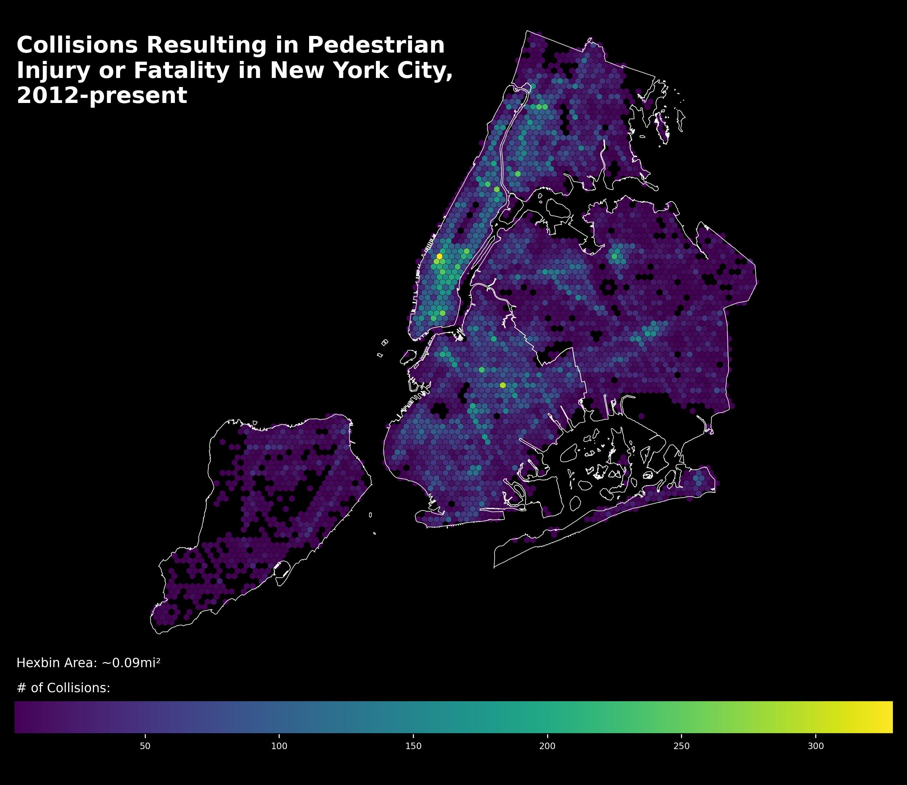

# Visualizing NYC's Pedestrian Safety Problem

This repo contains code and graphics from a personal project of mine visualizing New York's pedestrian safety problem. The project was inspired by an April 2023 article from the New York Times, ["When a Walkable City Becomes a Death Trap"](https://www.nytimes.com/2023/04/28/nyregion/traffic-deaths-nyc-vision-zero.html?unlocked_article_code=1gi5uH3t2H6TnCqph6pw9xviB9APXh0DxaC0EnhFOiKp_v7h3BF4SGk5WZPsudW66gnT5JdrOnLG8VfntBFZgUA4Pg0fK_DL16WDAkccxK4T6Mjkbmz7E4NFSJIjKTxq5wlmShvlND_SAdeOjDyLePMwf-tRvkAP_27t_ag4g18_-p1tpnG_db0M0IdaATiQ0jhO8rJqCaTpx1ovEGz6TV2y0zNOv2p1KT8vGpKmf52CJSzbZ3VmYZzOW3R_bHc36KVimCs5aDcFk_tsCjUqN_hhIGjOTsA7vT5rE94mjoCYTGbS4N9pCy1sq90d3kWbRpHBIFA8EhghEbi9GGeve2zHsSuBGrG_uw&giftCopy=4_Disclaimer&smid=url-share), which probes the worrying uptick in pedestrian deaths in New York. My aim with this project was to further explore the spatial distribution of serious pedestrian incidents in NYC and identify problem areas. Particular attention was paid to intersections, which the article notes are the most common site for pedestrian collisions.

For this project I made use of the Motor Vehicle Collisions Dataset available through NYCOpenData. While comprehensive and updated daily, the collisions dataset still has some data quality problems; the first notebook in this repo is devoted to geocoding those records without given latlongs. The second notebook takes the geocoded dataset and visualizes the spatially distribution of serious pedestrian incidents, both generally and by Neighborhood Tabulation Area (NTA). In the third notebook I turn my focus to intersections, at which it turns out about 80% of serious pedestrian incidents take place. New York's most dangerous intersections are identified and mapped; the final product is an interactive map letting the viewer explore those intersections in the 99th percentile of pedestrian incidents.

# New York's Most Dangerous Neighborhoods for Pedestrians?

