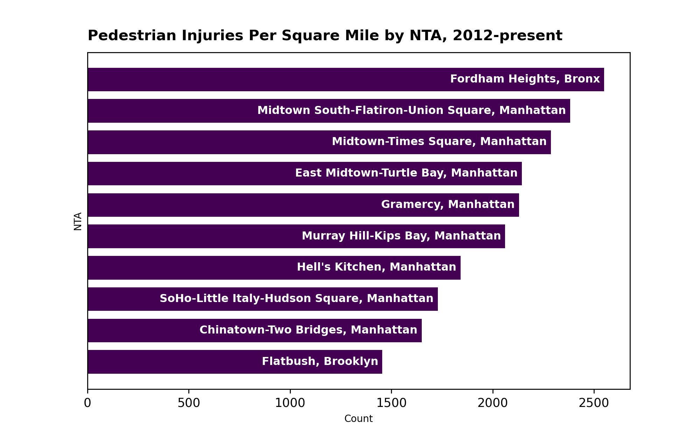
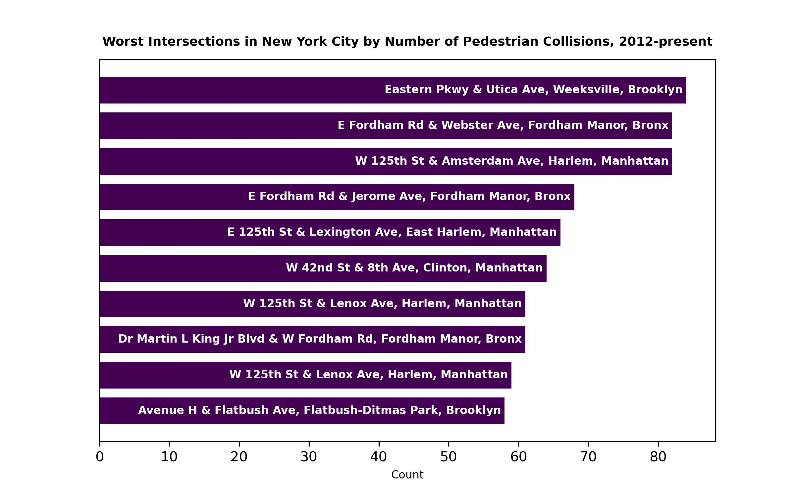

# Visualizing NYC's Pedestrian Safety Problem

This repo contains code and graphics from a personal project of mine visualizing New York's pedestrian safety problem. The project was inspired by an April 2023 article from the New York Times, ["When a Walkable City Becomes a Death Trap"](https://www.nytimes.com/2023/04/28/nyregion/traffic-deaths-nyc-vision-zero.html?unlocked_article_code=1gi5uH3t2H6TnCqph6pw9xviB9APXh0DxaC0EnhFOiKp_v7h3BF4SGk5WZPsudW66gnT5JdrOnLG8VfntBFZgUA4Pg0fK_DL16WDAkccxK4T6Mjkbmz7E4NFSJIjKTxq5wlmShvlND_SAdeOjDyLePMwf-tRvkAP_27t_ag4g18_-p1tpnG_db0M0IdaATiQ0jhO8rJqCaTpx1ovEGz6TV2y0zNOv2p1KT8vGpKmf52CJSzbZ3VmYZzOW3R_bHc36KVimCs5aDcFk_tsCjUqN_hhIGjOTsA7vT5rE94mjoCYTGbS4N9pCy1sq90d3kWbRpHBIFA8EhghEbi9GGeve2zHsSuBGrG_uw&giftCopy=4_Disclaimer&smid=url-share), which probes the worrying uptick in pedestrian deaths in New York. My aim with this project was to further explore the spatial distribution of serious pedestrian incidents in NYC and identify problem areas. Particular attention was paid to intersections, which the article notes are the most common site for pedestrian collisions.

For this project I made use of the [Motor Vehicle Collisions Dataset](https://data.cityofnewyork.us/Public-Safety/Motor-Vehicle-Collisions-Crashes/h9gi-nx95/about_data) available through NYC OpenData. While comprehensive and updated daily, the collisions dataset still has some data quality problems; the first notebook in this repo is devoted to geocoding those records without given latlongs. The second notebook takes the geocoded dataset and visualizes the spatial distribution of serious pedestrian incidents, both generally and by NTA. In the third notebook I turn my focus to intersections. New York's most dangerous intersections are identified and mapped; the final product is an interactive map letting the viewer explore those intersections in the 99th percentile of pedestrian incidents.

# New York's Most Dangerous Neighborhoods for Pedestrians?

In New York, the most commonly used administrative unit is Neighborhood Tabulation Area (NTA). Therefore I figured it would make sense to map pedestrian incidents by NTA. While the results are kind of interesting, I also think they're not all the helpful due to the old problem with choropleths and small areas. When you normalize by square mileage, the small NTA's end up taking more of the blame than they should if they contain a particularly bad intersection. That's why I decided to get the root of the problem and just focus on intersections in my final notebook.

# New York's Worst Intersections

The overhwelming majority of serious pedestrian collisions in New York take place at intersections - according to my calculations, about 81% of them. 

In the final part of my project, I wanted to identify and visualize New York's most dangerous intersections by number of collisions. There are a lot of intersections in New York, though, so I decided to map by borough initially. 

These maps look cool, but they're not necessarily helpful as a planning tool. You can't tell which intersections are the worst just by looking at them! So I made a less pretty but much more informative interactive map with New York's worst intersection by number of collisions (99th percentile); there's also a layer for individual pedestrian fatalities. And for the nosy, I charted New York's 10 worst intersections:

<iframe src='nyc_interactive.html' width = '500' height = '500'></iframe>
